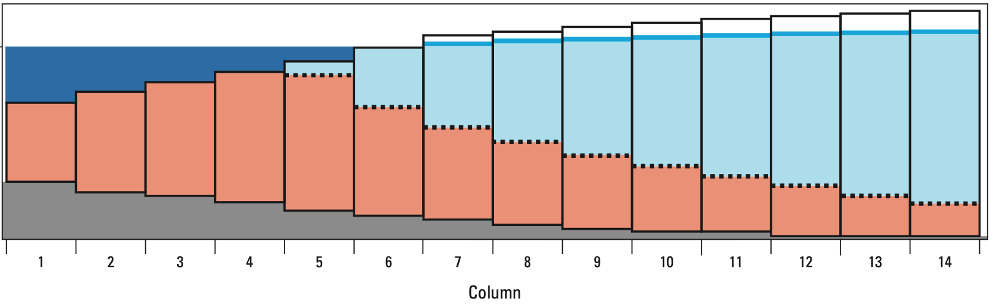

# modflow6-swi
Repository of materials used in the development of the sea water intrusion (SWI) package for MODFLOW 6 

The SWI Package for MODFLOW 6 is being developed on a [feature branch](https://github.com/langevin-usgs/modflow6/tree/feat-swi-correction2).  Recent copies of the input instructions and windows executable can be downloaded from the [releases](https://github.com/langevin-usgs/modflow6-swi/releases) on this repository.

If you want to try the new SWI Package for MODFLOW 6, the following steps will get you started:

1.  Download the executable from the [releases](https://github.com/langevin-usgs/modflow6-swi/releases) tab and put it somewhere accessible.

2. Regenerate the flopy classes to match the capabilities in the feature branch using the following command.  Note that running this command will change your flopy installation as described in the [instructions for generating classes](https://flopy.readthedocs.io/en/latest/md/generate_classes.html).

```
python -m flopy.mf6.utils.generate_classes --owner langevin-usgs --ref feat-swi-correction2
```

3.  There are a collection of notebooks in this repository that may provide some inspiration.  There are also tests that are being developed as part of the SWI implementation in MODFLOW 6.  The names of these tests start with `test_gwf_swi` and can be found in the [autotest folder of the feature branch](https://github.com/langevin-usgs/modflow6/tree/feat-swi-correction2/autotest).